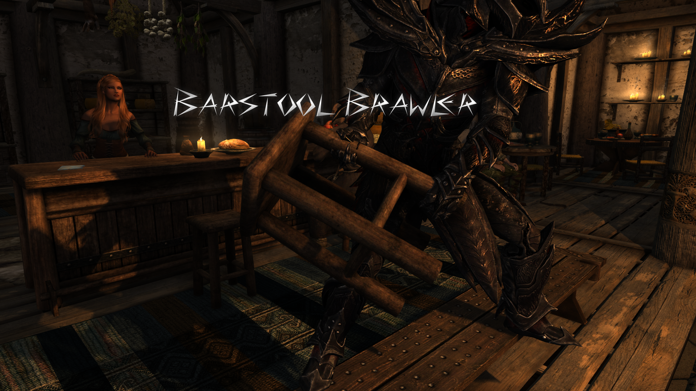

# Barstool Brawler

A Skyrim Special Edition mod By Mark E. Kraus.

My mods:

* [Barstool Brawler](https://www.nexusmods.com/skyrimspecialedition/mods/61354)
* [Chairhammers - Chair Warhammers](https://www.nexusmods.com/skyrimspecialedition/mods/61304)
* [Chairrows - Chair Arrows](https://www.nexusmods.com/skyrimspecialedition/mods/61168)
* [Cheat Jewelry](https://www.nexusmods.com/skyrimspecialedition/mods/58973)
* [Cheat Powers](https://www.nexusmods.com/skyrimspecialedition/mods/58892)
* [Exit Combat Power](https://www.nexusmods.com/skyrimspecialedition/mods/58651)
* [Sentient Chairs of Skyrim (SCOS)](https://www.nexusmods.com/skyrimspecialedition/mods/59604)

## About Barstool Brawler

This mod adds a barstool weapon to Skyrim.

## Features

### Barstool Weapon

The Barstool weapon is similar to the Steel Warhammer.

## Installation

### Requirements

This mod requires [SKSE](https://skse.silverlock.org/)

### NMM/Vortex

Download and install with Vortex and the FOMOD installer will take care of the rest.

### Manual

* Extract the 7z file using 7-Zip.
* Copy the extracted `MarkekrausBarstoolBrawler.esp` and `MarkekrausBarstoolBrawler.bsa` files to the `data` folder under your Skyrim: Special Edition installation folder.
* Enable the plugin using whatever method you usually use.

### Load Order

This mod can be installed in any order.

## User Guide

The Barstool weapon can be crafted at a blacksmith's forge using the same materials as normal warhammers of the same type. It can also be upgraded at Grindstones.

The Barstool weapon is equipped like normal warhammers and is used the same as well.

The Barstool weapon can also be bought from blacksmiths and any other vendors that normally sell warhammers.

Enemies may also be armed with the Barstool weapon. They may attack you with them or you may find them on their dead bodies.

The Barstool weapon may also be found in chests.

## Compatibility

This mod should be compatible with everything.

This mod has scripted compatibility with [Valdacil's Item Sorting](https://www.nexusmods.com/skyrimspecialedition/mods/5224). No patch is required.

## Warning: Not Lore-friendly

This mod is technically not lore-friendly because Barstool weapons are silly.
